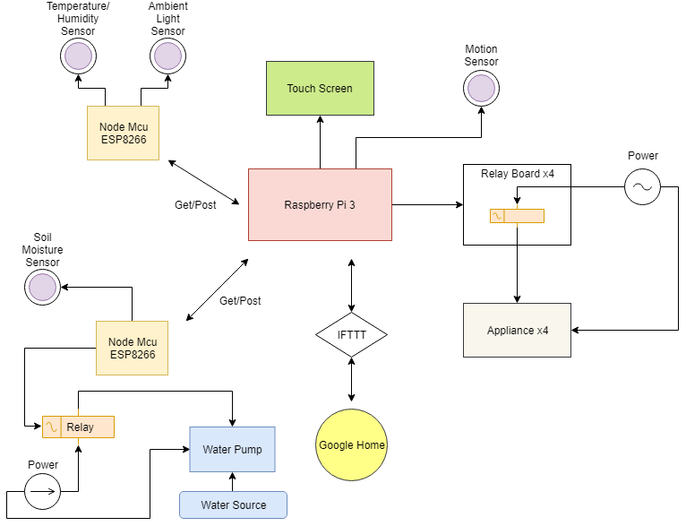
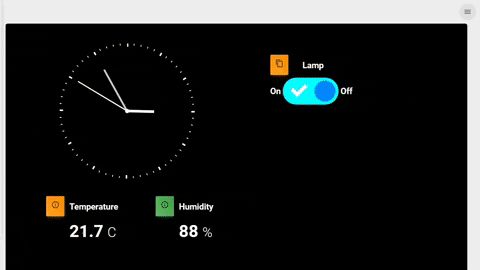

[IOT Home Automation]


## File Structure

Within the download you'll find the following directories and files:

```
.
├── README.md
├── documentation
├── package.json
├── server.js
└── scripts
    └── c
        ├── dht11.c
    └── js
        ├── backlightControl.js
        ├── dht11Control.js
        ├── switchControl.js
└── client
        ├── README.md
├── node_modules
├── resources
└── bootScript.sh

```

## Hardware Setup


## Preview
